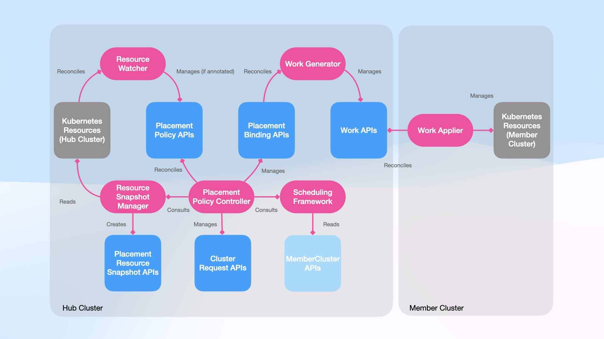
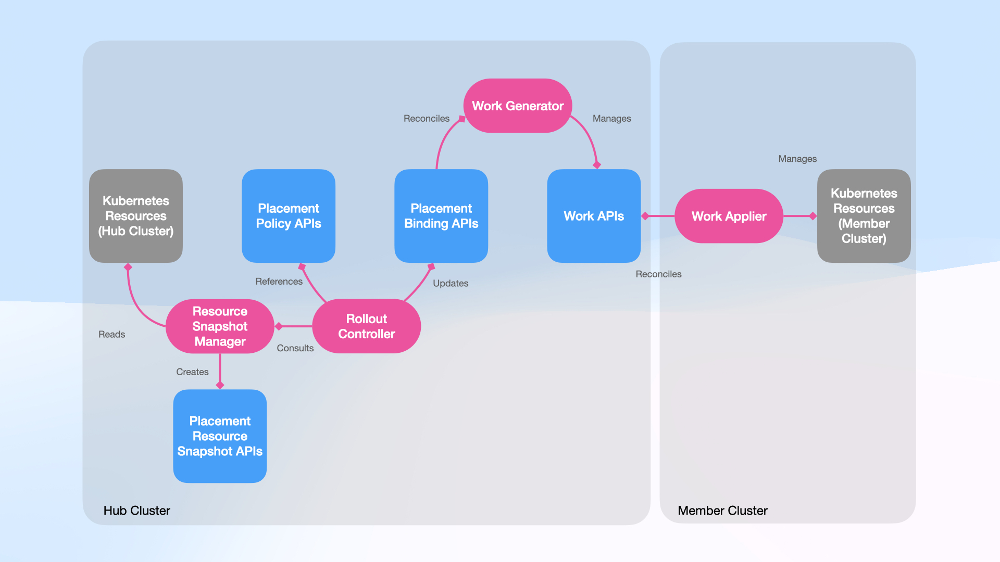

# FEP-0001: Placement Policy APIs

## Table of Contents

- [Summary](#summary)
- [Motivation](#motivation)
  - [Goals](#goals)
  - [Non-Goals](#non-goals)
- [Proposal](#proposal)
  - [`PlacementPolicy` APIs](#placementpolicy-apis)
  - [Cluster requests](#cluster-requests)
    - [Annotation-based placement](#annotation-based-placement)
    - [How the `PlacementPolicy` APIs work](#how-the-placementpolicy-apis-work)
  - [User Stories (optional)](#user-stories-optional)
    - [Story 1](#story-1)
    - [Story 2](#story-2)
  - [Notes/Constraints/Caveats (optional)](#notesconstraintscaveats-optional)
    - [About having two placement experiences in KubeFleet](#about-having-two-placement-experiences-in-kubefleet)
  - [Risks and Mitigations](#risks-and-mitigations)
    - [Interference between the two placement experiences](#interference-between-the-two-placement-experiences)
- [Design Details](#design-details)
  - [The API definition of the `PlacementPolicy` APIs](#the-api-definition-of-the-placementpolicy-apis)
    - [About the optional fields in the `PlacementPolicy` APIs](#about-the-optional-fields-in-the-placementpolicy-apis)
    - [The placement policy status](#the-placement-policy-status)
  - [The API definition of the `ClusterRequest` API](#the-api-definition-of-the-clusterrequest-api)
    - [The cluster request status](#the-cluster-request-status)
- [Security and Privacy](#security-and-privacy)
- [Observability](#observability)
- [Scalability](#scalability)
- [Compatibility](#compatibility)
  - [Same version](#same-version)
  - [Version skew](#version-skew)
- [Test Plan](#test-plan)
  - [Prerequisites](#prerequisites)
  - [Unit tests and integration tests](#unit-tests-and-integration-tests)
  - [E2E tests](#e2e-tests)
  - [Compatibility tests](#compatibility-tests)
- [Graduation Criteria](#graduation-criteria)
  - [Graduating from the alpha level](#graduating-from-the-alpha-level)
- [Dependencies](#dependencies)
- [Drawbacks and Alternatives](#drawbacks-and-alternatives)
- [Implementation History](#implementation-history)

## Summary

This enhancement proposes a new placement experience for KubeFleet, which features:

* a declarative placement API (and its cluster-scoped variant) that is simplified, flexible, and designed for a
vision where KubeFleet runs in a highly dynamic multi-cluster environment where clusters can be provisioned on demand as needed.
* support for an easier-to-use and easier-to-adopt, annotation-based placement workflow that helps KubeFleet users to achieve
some of the most common and straightforward placement scenarios without having to spell out every detail.

The new experience will run in parallel with the current placement experience, using two separate API groups; the current placement
APIs (`ResourcePlacement` and its cluster-scoped variant) will remain unchanged and fully supported. This helps the team
iterate upon the new experience fast with no risk of breaking existing placements or bringing out unexpected behavior changes.

## Motivation

So far KubeFleet provides developers and admins a placement experience under the assumption that KubeFleet operates in a multi-cluster
environment with a, relatively speaking, fixed and static set of clusters; each of which is crafted beforehand, maintained carefully, and has
a lifecycle that spans multiple, if not more, major Kubernetes releases. This pattern, for a very long while, has been the status quo
in the Kubernetes community, with many organizations having teams of engineers dedicated to the lifecycle management tasks of their Kubernetes
clusters.

However, at its core a Kubernetes cluster is merely an abstraction layer of a set of computing resources; it is a stage where action
happens, yet, however grand and marvelous the stage might be, it is not the action itself. And the stage can be built,
torn down, and rebuilt, wherever and whenever needed in many circumstances. As Kubernetes continues to evolve, many once tedious
cluster management tasks can now be automated, and we see fast adoption of "automatic" Kubernetes solutions across many platforms,
which deeply challenges our prior assumption of a relatively static multi-cluster environment. Developers and admins are now able to
spin up production ready Kubernetes clusters in any region with one click, request new nodes of various sizes and capabilities on demand,
and upgrade clusters in a blue/green fashion with no downtime and no cordoning needed. The new possibilities would inevitably change the way
how users place their Kubernetes resources across clusters, and KubeFleet's core capability, its placement experience, needs to adapt
accordingly.

Excited as we are about the new possibilities, it has come to our realization that KubeFleet's current placement experience, primarily its
`ResourcePlacement` and `ClusterResourcePlacement` APIs, are not equipped to handle well the new scenarios that arise from a highly dynamic
multi-cluster environment. Specifically:

* The current placement APIs require users to specify **exactly one scheduling constraint of a specific type**, which KubeFleet uses to
**filter** all member clusters for placement purposes. This greatly limits the flexibility of a placement when KubeFleet makes cluster
scheduling decisions, due to expressiveness complications.

    For example, to place resources across clusters via a `ResourcePlacement` (or its cluster-scoped variant), one must pick one of the three
    placement types first in the current APIs:

    * `PickAll`: place resources to all member clusters that satisfy the scheduling constraint;
    * `PickN`: place resources to N member clusters out of all member clusters that satisfy the scheduling constraint; or
    * `PickFixed`: place resources to member clusters by their names.

    The three options are mutually exclusive, and once a choice has been made, it cannot be changed without re-creating the placement API
    object. If a user would like to achieve use cases like:

    * _As a multi-cluster admin, I would like to run my workloads on all the member clusters from the staging cluster group, and one of
    the member clusters in the canary cluster group, to test things out._

    One would need to set up two separate placement API objects and manage them separately, as the case itself cannot be expressed as one
    single scheduling constraint.

    Another complication is that, as the scheduling constraint is used for filtering purposes, the cluster scheduling outcome depends not
    only on the scheduling constraint itself (which users have control of), but also the setup and distribution of the member clusters
    (which users might have no control of). Take the `ClusterResourcePlacement` API object below as an instance:

    ```yaml
    apiVersion: placement.kubernetes-fleet.io/v1
    kind: ClusterResourcePlacement
    metadata: ...
    spec:
      ...
      placementType: PickN
      numberOfClusters: 6
      affinity:
        clusterAffinity:
          requiredDuringSchedulingIgnoredDuringExecution:
            clusterSelectorTerms:
            - labelSelector:
                matchLabels:
                  region: eastus
            - labelSelector:
                matchLabels:
                  region: westus
    ```

    The placement itself would replicate selected Kubernetes resources to 6 member clusters in either the `eastus` or `westus` region. However,
    exactly how clusters are picked between the two regions is indeterminate by the placement itself; one region might be heavily under-picked,
    while the other one being heavily over-picked, as 0 clusters from the `eastus` region + 6 from the `westus` region is an outcome
    that is as valid as the one where 3 clusters from each region are picked, under the setup above. If the user were to complete
    a placement scenario like:

    * _As a multi-cluster admin, I would like to run one application replica in the `eastus` region, where traffic is relatively low, and
    5 in the `westus` region, where traffic is heavier._

    They would need to, once again, set up and manage two separate placements due to expressiveness limitations. And such limitations would
    only get worse when users add finer-grained conditions in the scheduling constraints.

* As the scheduling constraint is for filtering purposes only, KubeFleet **will not track how well the constraint is fulfilled**, and 
consequently **cannot account for the possibility that a better placement outcome would be achieved** if a more appropriate member cluster
were to be requested and added to the fleet. 

    This is a case that can be better exemplified with a high-availability focused use case, which is a common scenario in multi-cluster
    environments:

    _As a multi-cluster admin, I would like to spread my workloads evenly across the `eastus`, `westus`, and `centralus` regions for
    availability considerations._

    In the current placement APIs, KubeFleet does provide support for topology spread constraints, which helps users to establish
    even distribution across cluster groups in a placement; the use case earlier can be translated into the placement API object below:

    > KubeFleet models its topology spread constraints API after Kubernetes' pod topology spread constraints API; for more information
    > on how the mechanism functions, see also the
    > [Kubernetes documentation](https://kubernetes.io/docs/concepts/scheduling-eviction/topology-spread-constraints/).

    ```yaml
    apiVersion: placement.kubernetes-fleet.io/v1
    kind: ClusterResourcePlacement
    metadata: ...
    spec:
      ...
      placementType: PickN
      numberOfClusters: 3
      affinity:
        # Pick all clusters with the label expression `region in (eastus, westus, centralus)`.
        ...
      topologySpreadConstraints:
      # A topology spread constraint works by grouping clusters into topology domains based on the `topologyKey` (in this case
      # the value of the `region` label on each member cluster), and make sure that the diff between the numbers of clusters
      # picked from any two topology domains does not exceed the `maxSkew` value.
      #
      # Due to logical limitations, maxSkew must be greater than 0.
      - maxSkew: 1
        topologyKey: region
        whenUnsatisfiable: DoNotSchedule
    ```

    If there happens to be just some member clusters in all of the three regions, users would find that the cluster scheduling outcome is
    consistent with their expectation, with one cluster picked from each region thanks to the topology spread constraints. Yet, if,
    as an illustration, there is no member cluster in the `centralus` region, KubeFleet would happily pick two clusters from the
    `eastus` region and one from the `westus` region, as it still satisfied the topology spread constraints (the skew would be `2 - 1 = 1`),
    even if it is not the outcome the user would expect. Joining a member cluster from the `centralus` region later would not help either,
    unless the user chooses to manually evict one of the clusters from the overpicked `eastus` region.

To summarize, the placement experience we have so far is **more imperative in nature**, to use the term very loosely. We expect users to have
a general recognition of where their clusters are and how they are set up, and then ask for an explicitly defined scheduling constraint to
filter the member clusters for placement purposes. If the users do run KubeFleet in an environment with a fixed, static set of clusters,
the experience and its deficiencies mentioned above might be less of a concern; however, for a more platform-oriented environment with
a highly dynamic set of clusters with the capability to provision member clusters on demand, the imperative approach would turn into a blocker.
Such environments would work best with a more **declarative** placement experience, where users express their intent in the form of
**scheduling requirements** and look to KubeFleet to make the orchestration possible; if there are no available candidates, with permission
from the users, KubeFleet can yield signals that the platform/cloud provider in use, such as
[the Cluster API project (CAPI)](https://cluster-api.sigs.k8s.io/), can reconcile and act upon, to provision the candidate on demand.
This is the scenario that initially motivated the proposal.

In addition, as briefly mentioned in the summary, this proposal also aspires to introduce an annotation-based placement workflow
in KubeFleet. Through the past few development cycles, we have learned, from feedback and user outreach, that in many circumstances,
users look to only complete a very straightforward placement scenario that involves one single resource and a clear, explicitly defined
set of target clusters, such as placing a Kubernetes namespace, deployment, or a policy API object to all member clusters. For such
cases, asking users to compose a placement API object with all the details spelled out feels quite heavy and unnecessary, and
as a result we would like to simplify the flow by allowing users to place their resources with a simple annotation on the resource itself;
KubeFleet will handle the rest of the process. It is our hope that this would help make KubeFleet easier to use and to adopt, especially
for users who are just getting started with KubeFleet and multi-cluster management in general.

### Goals

* Deliver a new placement experience, backed by a set of new placement APIs, built for highly dynamic multi-cluster environments:
    * Let users express individual scheduling requirements instead of a single filtering constraint, and have KubeFleet track each
    requirement and fulfill it to the best of its ability.
    * Produce hints/signals that platforms/cloud providers, such as CAPI, reconcile and act upon to provision clusters on demand when
    no candidate exists in the fleet.
* Add an annotation-based placement workflow that lets users place resources with a single annotation on the resource itself, with no
placement API object to author.

### Non-Goals

* The new placement experience (and its APIs) is **not** an immediate replacement for the current placement experience. 
    * The current placement experience (primarily the `ResourcePlacement` and `ClusterResourcePlacement` APIs) will remain unchanged
    and fully supported.
    * We do not aim for feature parity between the two placement experiences for now.
    * We will not provide a migration path between the two placement experiences for now, as they are designed for different placement
    scenarios and use cases; even though there would surely be many overlaps.
* The new placement experience is **not** a rewrite of the KubeFleet project of any sort. Despite the presence of different APIs and
their corresponding placement experiences, the core KubeFleet architecture and the flow of information would remain the same, and
much of the logic will be reused in both placement experiences.
* KubeFleet excels at its placement capabilities; it is not a platform that manages the lifecycle of member clusters. The proposal
sets up KubeFleet so that its placement capabilities can connect with platforms/cloud providers that manage the lifecycle of member
clusters, but it does not aim to provide such capabilities itself.
    * The new placement experience does not require the presence of such platforms/cloud providers to function either. Even though it
    is designed for a multi-cluster environment of a more dynamic nature, it would function just as well in less dynamic environments.
    We do not see different types of environments, but more of a spectrum where KubeFleet operates equally well on both ends.

## Proposal

### `PlacementPolicy` APIs

This enhancement proposes a new placement API, `PlacementPolicy` (and its cluster-scoped variant, `ClusterPlacementPolicy`)
to be added to KubeFleet. 

A `PlacementPolicy` features two required fields only:

* `resourceSelectors`, for a set of resource selectors; and
* `clusterSelectors`, for a set of cluster selectors.

The example below selects a Kubernetes `Deployment` object that will be placed to all member clusters with the `env=staging` label,
and one of the member clusters with the `env=canary` label from the `eastus` region:

```yaml
apiVersion: placement.kubefleet.dev/v1alpha1
kind: PlacementPolicy
metadata:
  name: app
  namespace: work
spec:
  resourceSelectors:
  - group: apps
    version: v1
    kind: Deployment
    name: nginx
  clusterSelectors:
  - terms:
    - matchLabels:
        env: staging
    count: All
  - terms:
    - matchLabels:
        env: prod
        topology.kubernetes.io/region: eastus
    count: 1
```

A resource selector helps select one or more Kubernetes resources of the same GVK using names or label selectors. Consistent with Kubernetes
idioms, resource selectors from `ClusterPlacementPolicy` API objects, can select cluster-scoped resources and namespace-scoped resources
from all namespaces, while those from `PlacementPolicy` API objects can only select resources within the same namespace as the
`PlacementPolicy` API objects themselves.

Each cluster selector is a scheduling requirement of its own that KubeFleet will track and fulfill independently. One may select clusters
using label matchers (e.g., `env=staging`), label expressions (e.g., `region in (eastus, westus)`), or cluster property expressions
(e.g., `k8s.io/k8s-version in ["v1.35"]`). KubeFleet reserves a special label, `kubefleet.dev/cluster-alias`, which users can use to select
clusters by their names (aliases). A cluster selector also features a `count` field, which accepts either a positive integer or a special
value `All`, to specify how many clusters are needed based on the given scheduling requirement.

<details>
  <summary>Note: why use a label instead of a direct name reference?</summary>

> The label gives users a level of indirection when selecting clusters, which can be useful in scenarios like cluster replacements.
> A common scenario (and a key pain point) in multi-cluster management is that often clusters need to be replaced due to various reasons
> such as failures, upgrade complications, misconfigurations, etc. And the replacement process typically involves the engineering team
> joining a new cluster to the fleet, migrating resources from the old cluster to the new one, and then decommissioning the old cluster.
> If the users were using direct name references to select clusters, they would need to manually update the references to keep things
> consistent after the replacement; with an indirect label reference, however, things become much easier, as the team only needs to
> switch the label afterwards.

</details>

The list of cluster selectors are evaluated in the order of each item's appearance. For simplicity reasons, we do not aim to make cluster
selectors commutative. If a cluster has been selected by a selector on the top of the list, it will not count towards any selector below
it, even if it still matches with such selector. A selector with the count `All` will select all the clusters that match with it and have
not been selected by any selector above.

A cluster selector might match with more clusters than its specified count; in such cases,
KubeFleet will pick clusters based on the criteria below, under the principle of spreading placements as evenly as possible across
a homogeneous set of clusters:

* prefer clusters with lower node count;
* prefer clusters with more available CPU resources;
* prefer clusters with more available memory resources;

The preferences are calculated as follows, similar to the one Kubernetes uses by default (the `LeastAllocated` strategy):

* each criterion is assigned with a weight score of 100, and a cluster receives a score `S = 100 * (X - Min) / (Max - Min)`,
if the criterion prefers higher values, or `S = 100 - 100 * (X - Min) / (Max - Min)`, if the criterion prefers lower values.
In the formulas, `X` is the current metric value for the cluster on the criterion; `Min` and `Max` are the currently
observed minimum and maximum values for the criterion among all clusters that match the cluster selector. When `Min` equals `Max`
on a criterion, all clusters receive a score of 0 for the criterion.
* KubeFleet then sums up the scores for all criteria by cluster, and picks clusters with higher total scores.

As a final tie-breaker, KubeFleet will pick clusters based on their names in lexicographical order. Preferences are sticky once made.

If a user edits a cluster selector in a placement so that it has a count fewer than before, KubeFleet will drop a cluster selected by the
selector using the reverse of the criteria above.

<details>
  <summary>Note: about customizable preference</summary>

> We understand that there are use cases where users would like to have more control over the preferences, e.g.,
> to use the `MostAllocated` strategy to achieve bin-packing; if there are strong signals for such a need,
> as the new experience evolves, it is relatively easy for us to add additional fields in the API to allow
> finer tuning.

</details>

### Cluster requests

When a cluster selector (a scheduling requirement) cannot be fulfilled, KubeFleet can request a new cluster from the environment,
provided that proper platform/cloud provider support is available. Specifically, KubeFleet can produce a signal, in the form
of a `ClusterRequest` API object:

```yaml
apiVersion: placement.kubefleet.dev/v1alpha1
kind: ClusterRequest
metadata: ...
spec:
  placementPolicyRef:
    name: app
    namespace: work
  clusterSelector:
  - terms:
    - matchLabels:
        region: eastus
```

Obviously, not all scheduling requirements can be translated into a cluster request. KubeFleet will provide options for admins
to specify which keys are eligible for cluster requests; if a cluster selector contains an ineligible key in its label matchers,
label expressions, or cluster property expressions, KubeFleet will not submit a cluster request when it cannnot be fulfilled. Users also
have the option to explicitly disable cluster requests for a cluster selector.

KubeFleet expects that the cluster request will be reconciled by the platform/cloud provider in use. A cluster request is in essence
a hint of what kind of cluster is needed; it is not a full specification of a Kubernetes cluster. KubeFleet assumes that the underlying
platform/cloud provider owns a `class`-like configuration (such as `ClusterClass` objects in the Cluster API project) that can function
as cluster blueprints, which would take the hint from KubeFleet as inputs/overrides and prepare the new cluster accordingly. KubeFleet
will withdraw a cluster request when a candidate for the scheduling requirement is found.

A concern is that, in the new experience, multiple placements might be submitting cluster requests at the same time, and the addition
of a new cluster to the fleet might be able to satisfy multiple unfulfilled cluster selectors across different placements. Considering that
multiplexing and de-multiplexing overlapping scheduling requirements/constraints can be quite complicated, if not at all impossible, KubeFleet
will not attempt to arrange/compose cluster requests across placements; instead:

* KubeFleet will provide user-configurable limits (one by default) on the number of concurrent cluster requests that can be
submitted by a placement and across the fleet;
* Any platform/cloud provider controller for cluster provisioning should also have its own limits on the number of concurrent cluster
requests that it can handle;
* The cluster request API features a field in the status, `LatestObservedClusterCreationTimestamp`, that denotes the latest creation
timestamp of all member clusters evaluated by the placement policy that creates the cluster request; if the platform/cloud provider
controller finds that a new cluster has been added but a cluster request has not yet evaluated all clusters, i.e., the latest creation
timestamp has lagged behind, it can simply ignore the cluster request and wait for the placement controllers to catch up;

Admittedly this is a best-effort approach and there might still be cases where clusters are over-provisioned; however, this should be a
reasonable trade-off between complexity and efficiency, with limited impact even under the worst case scenarios.


#### Annotation-based placement

For simpler placement scenarios, users can now annotate their resources to have them placed across clusters. Initially we have planned
support for the following three annotation-based scenarios:

* place a resource to all member clusters in the fleet, via the `kubefleet.dev/PLACEHOLDER` annotation;
* place a resource to member clusters by their names (aliases) in the fleet, via the `kubefleet.dev/PLACEHOLDER` annotation; and
* place a resource to member clusters from specific regions, in a one cluster per region manner, via the
`kubefleet.dev/PLACEHOLDER` annotation.

The three annotations are mutually exclusive. Once annotated, KubeFleet will create a `PlacementPolicy` API object that selects
the resource with an appropriate cluster selector; the name of the `PlacementPolicy` API object will be added to the resource
as an annotation for tracking purposes. Users may edit/remove the annotation on the resource; KubeFleet will update/delete the corresponding `PlacementPolicy` API object as appropriate. If the resource itself is deleted, the `PlacementPolicy` API object will be deleted as well.

Sometimes a Kubernetes resource might have its dependencies. For example, a `Deployment` object might have `ConfigMaps` or `Secrets` that
are referenced in its pod template; for a subset of well-known Kubernetes resources, namely `deployments`, `statefulsets`, `daemonsets`,
`replicasets`, `jobs`, and `cronjobs`, KubeFleet will automatically detect such dependencies and add them to the resource selectors of
the `PlacementPolicy` API object it creates.

For more complex placement scenarios, it is still recommended that users create `PlacementPolicy` API objects directly, for a
finer-grained control over the placement process.

#### How the `PlacementPolicy` APIs work

As briefly discussed earlier, the new placement experience is not a rewrite of the KubeFleet project, and this document does not propose
any major overhaul to the architecture of KubeFleet. The high-level architecture that supports the new placement experience is
illustrated below:



> Legend
>
> * Blue nodes: new placement API objects and their supporting API objects;
> * Magenta nodes: controllers that facilitate the new placement experience;
> * Gray nodes: non-KubeFleet API objects

In the architecture, resource snapshots, bindings, and works are all known and well-established concepts in KubeFleet; their roles and
responsibilities remain the same. The control loops in the resource watcher, work generator, and work applier controllers would stay
largely consistent as well. This proposal features a brand new controller, the placement policy controller, for reconciling
the new placement API objects and managing bindings and cluster requests. KubeFleet already features a scheduling framework for filtering
member clusters based on scheduling constraints; it would require some adjustments to support the resolution of scheduling requirements.
However, the core scheduling logic, specifically matching clusters based on label matchers, label expressions, and
cluster property expressions, should not require any substantial modification.

With the addition of the new placement policy controller, this enhancement proposes the following behavior changes in
the new placement experience:

* In the current placement experience, by default, KubeFleet snapshots resources selected for a placement as soon as it detects a change
from the resources (with an optional user-configurable wait period); the snapshots are later kept for rollout purposes. This constant
snapshotting behavior incurs a performance overhead, and risks capturing an inconsistent state of resources under adverse circumstances.
To address this concern, the new placement experience snapshots resources only when a placement is first created, or when a rollout
is initiated; resource changes alone will not trigger a snapshot.

* The current placement experience requires that all resource changes and cluster scheduling decision changes are applied together
via KubeFleet's rollout APIs. If the user would like to add/drop a cluster from a `ResourcePlacement` (or `ClusterResourcePlacement`)
API object by changing its scheduling constraint, or a new cluster becomes selected by the placement, the change will never take
effect until the user initiates a rollout. And such rollout would apply all resource changes to the selected clusters, even if the
user might not be ready to do so at the time. This coupling has brought about some confusion among users; they might run into
situations where:
    * they would like to apply a cluster scheduling decision change, yet the rollout gets blocked due to a resource change failing to be
    applied to a selected cluster; or
    * they would like to apply a resource change, yet the rollout gets blocked due to a newly selected/de-selected cluster not responding
    to KubeFleet.

    The new placement experience, instead, proposes a decoupled approach. Any changes to the scheduling requirements in a `PlacementPolicy` (or `ClusterPlacementPolicy`) API object will be applied immediately, facilitated by the new placement policy controller. KubeFleet's
    rollout APIs process resource changes exclusively; they are no longer responsible for applying cluster scheduling decision changes.

    The diagram below illustrates how rollout APIs work in the new placement experience:

    

### User Stories (optional)

#### Story 1

* As a multi-cluster admin, I can specify individual scheduling requirements when placing resources across clusters, based on labels
and cluster properties, which are tracked and fulfilled by KubeFleet to the best of its ability.
    * If a candidate cannot be found for a specific scheduling requirement, with proper support from the platform/cloud provider in use,
    KubeFleet can request a new cluster to be provisioned on demand to fulfill the requirement, under my permission.
* As a multi-cluster admin, I can find out the fulfillment status of scheduling requirements in a placement, and (if applicable), the
status of any cluster requests submitted by KubeFleet.

* As a platform/cloud provider developer, I can watch for cluster requests submitted by KubeFleet, and fulfill them by provisioning
new clusters based on the corresponding scheduling requirements.

#### Story 2

* As a multi-cluster admin, I can place resources to clusters by annotating the resources, without having to explicitly create KubeFleet
placement API objects.

Initially, the annotation-based placement workflow will support the following scenarios:

* As a multi-cluster admin, I can place a resource to all member clusters in the fleet via annotations.
* As a multi-cluster admin, I can place a resource to member clusters by their names (aliases) in the fleet via annotations.
* As a multi-cluster admin, I can place a resource to member clusters from specific regions, in a one cluster per region manner, via
annotations.

### Notes/Constraints/Caveats (optional)

#### About having two placement experiences in KubeFleet

It is not an easy decision for us to propose a new placement experience on top of the existing one. We understand that this would,
inevitably, complicate our API offering and our codebase and confuse some of the KubeFleet users, especially considering that
there are many scenarios that can be covered equally well in both experiences. We have evaluated many different alternatives, but they
all have their limitations. For example, we have considered the possibility of augmenting the existing placement APIs instead to
establish the new experience, such as adding a new placement mode in addition to the current set, `PickAll`, `PickN`, and `PickFixed`;
however, we fear that:

* it would make the current placement APIs more complicated and difficult to learn and to use;
* the current API design does not accommodate the new experience well, specifically the need for individual scheduling requirements, and
there might be many limitations and semantic complications;
* though it is not impossible to retrofit the existing codebase to support the new experience, it would require a significant amount
of engineering effort and many special cases/exceptions to be added in our logic, which impairs our project maintainability and
reliability, especially in the long run.
* more importantly, as an established project, we have users running with the existing placement experience, and it is important to make
sure that these setups continue to work with no risk of breakage; retrofitting, however, would inevitably increase the risk, despite our
best effort.

Another option we have thought about is to implement another layer on top of the existing placement experience, a set of controllers
that manipulate the `ResourcePlacement` and `ClusterResourcePlacement` APIs to achieve the new experience; the concern about this approach,
however, is that, engineering-wise it needs as much effort as implementing the new placement experience (if not more), yet usability-wise
it does not yield a substantially better result, and many deficiencies in the current experience would still linger.

Consequently, it is our belief that a new placement experience in juxtaposition with the current one is the best path forward for the
KubeFleet project at the moment, as it grants us the maneuverability to iterate upon the new experience as needed with minimal risk, and
the possibility to cover brand new use cases and identified UX issues alike. The dichotomy will not be permanent; as the new
experience matures and stabilizes, we will begin to explore the possibility of convergence as appropriate.

### Risks and Mitigations

#### Interference between the two placement experiences

The new placement experience runs side by side with the current one, but it uses a set of APIs under a different API group.
The reconciliation of such APIs will be completed via all new controllers, which ensures that the existing experience will stay
as it is with no risk of breakage or behavioral drifts, while enabling fast iteration. The separation of APIs also eliminates most of the
risk for name collisions between the two experiences should they need to co-exist.

Placing the same resource under both experiences to the same cluster at the same time will result in a user error. The KubeFleet
member agent (specifically its work applier controller), which serves the apply ops of resources for all placements to a cluster,
can already detect and report such errors; user will read from the error that the resource is currently managed by another placement
and cannot be applied to the same cluster.

## Design Details

### The API definition of the `PlacementPolicy` APIs

The `PlacementPolicy` APIs are defined as follows:

```go
type PlacementPolicy struct {
	metav1.TypeMeta   `json:",inline"`
	metav1.ObjectMeta `json:"metadata,omitempty"`

	// The desired state of the placement policy.
	Spec PlacementPolicySpec `json:"spec,omitempty"`

	// The observed status of the placement policy.
	Status PlacementPolicyStatus `json:"status,omitempty"`
}

// PlacementPolicySpec is the desired state of a PlacementPolicy.
type PlacementPolicySpec struct {
    // Required fields.

	// A list of resource selectors that specifies the resources to be placed by KubeFleet.
	//
	// +kubebuilder:validation:MinItems=1
	ResourceSelectors []SameNamespacedObjectReference `json:"resourceSelectors"`

	// A list of cluster selectors that select clusters where KubeFleet should
	// place resources.
	//
	// +kubebuilder:validation:MinItems=1
	ClusterSelectors []ClusterSelector `json:"clusterSelectors"`

    // Optional fields.

	// The resource revision history limit for this application. Each rollout attempt will
	// create a new resource revision, which is a snapshot of all the selected resources at the time point.
	ResourceRevisionHistoryLimit *int32 `json:"resourceRevisionHistoryLimit,omitempty"`

	// The strategy KubeFleet uses to synchronize resources to target clusters. Set this field
	// to configure how resources are applied, how to handle drifts/takeovers, and what to do with
	// placed resources when a placement is deleted.
	SyncStrategy *SyncStrategy `json:"syncStrategy,omitempty"`

	// The tolerations help KubeFleet to schedule resources to clusters despite the taints on them.
	Tolerations []Toleration `json:"tolerations,omitempty"`
}

type ClusterSelector struct {
	// A list of label and cluster property selectors that describe the clusters where KubeFleet should place
	// resources.
	//
	// The selectors are OR'd. If no selector is specified, all clusters are considered.
	Terms []LabelAndClusterPropertySelector `json:"terms,omitempty"`

	// The number of clusters to select given the list of label selectors.
	//
	// The default value is 1. To select all clusters that match the list of label selectors,
	// use the value "All".
	Count *intstr.IntOrString `json:"count,omitempty"`

    // If set to false, KubeFleet will not submit a cluster request when the cluster selector cannot be fulfilled.
    //
    // The default value is true. Note that this field takes effect if and only if cluster requests are enabled in KubeFleet.
    RequestClusterIfUnfulfilled *bool `json:"requestClusterIfUnfulfilled,omitempty"`
}

// A LabelAndClusterPropertySelector describes a set of cluster labels and cluster properties
// that KubeFleet uses to select clusters for resource placement.
//
// The inputs are AND'd. A cluster must match all the label and cluster property expressions in the
// selector to be selected by it.
type LabelAndClusterPropertySelector struct {
	// A list of label key-value pairs that a cluster must have.
	MatchLabels map[string]string `json:"matchLabels,omitempty"`
	// A list of label expressions that a cluster must satisfy.
	MatchLabelExpressions []LabelSelectorRequirement `json:"matchLabelExpressions,omitempty"`
	// A list of cluster property expressions that a cluster must satisfy.
	MatchClusterPropertyExpressions []LabelSelectorRequirement `json:"matchClusterPropertyExpressions,omitempty"`
}
```

#### About the optional fields in the `PlacementPolicy` APIs

The spec of the `PlacementPolicy` API (and its cluster-scoped counterpart) also includes three optional fields. Among them,
`ResourceRevisionHistoryLimit` and `Tolerations` are fields that also exist in the current placement APIs; they are structured the same
way as their counterparts in the `ResourcePlacement` and `ClusterResourcePlacement` APIs, and they have the same function.

`SyncStrategy` is a new optional field that is roughly equivalent to the combination of the
`.spec.strategy.applyStrategy` and `.spec.strategy.deleteStrategy` fields in the current placement APIs, but with a few name tweaks
and minor adjustments for better clarity. The `SyncStrategy` field is structured as follows:

> Note: despite the fact that `.spec.strategy.deleteStrategy` has been added to the current placement APIs, it has not been implemented
> yet and is not functional at the moment.

```go
type SyncStrategy struct {
	// The method KubeFleet uses to apply resources to target clusters.
	//
	// Available options are:
	// * ClientSideApply: KubeFleet applies resources to a target cluster using three-way merge patch, similar
	//   to how the Kubernetes CLI performs a client-side apply.
	// * ServerSideApply: KubeFleet applies resources to a target cluster using server-side apply, which allows
	//   the API server to manage conflicts and merge changes.
	//
	// The default value is ClientSideApply.
	ApplyMethod ApplyMethod `json:"applyMethod,omitempty"`

	// The options for running server-side apply ops. This field takes effect only if the apply method is
	// set to ServerSideApply.
	ServerSideApplyOptions *ServerSideApplyOptions `json:"serverSideApplyOptions,omitempty"`

	// How to handle resource co-ownership. This is most relevant when KubeFleet must manage resources that
	// are already (or expected to be) owned by other non-KubeFleet controllers in target clusters.
	//
	// Available options are:
	// * ShareOwnership: KubeFleet registers itself as a co-owner of the resource.
	// * ReportError: KubeFleet reports an error when a resource to be placed is already owned by other controllers.
	//
	// The default value is ReportError.
	WhenOwnedByOthers *WhenOwnedByOthersOption `json:"whenOwnedByOthers,omitempty"`

	// The action to take when a resource on the target cluster side has drifted from its desired state as controlled
	// by the placement. A drift can occur when a user or a controller on the target cluster makes an inadvertent change
	// to a KubeFleet-managed resource.
	//
	// Available options are:
	// * ApplyAnyway: KubeFleet applies the desired state, which might overwrite the drift.
	// * ReportError: KubeFleet reports an error and leaves the drift as is.
	//
	// The default value is ApplyAnyway.
	WhenDrifted *WhenDriftedOption `json:"whenDrifted,omitempty"`

	// The action to take when a resource to be placed already exists on the target cluster side and is not managed
	// by KubeFleet.
	//
	// Available options are:
	// * AlwaysTakeOver: KubeFleet takes over the resource by registering itself as an owner of the resource (if
	//   the resource has no owner or co-ownership is allowed). This enables KubeFleet to adopt the existing resource for
	//   centralized management.
	// * TakeOverIfNoDiff: KubeFleet takes over the resource only if the existing resource reads the same as the desired state
	//   specified on the hub cluster side.
	// * ReportError: KubeFleet reports an error and leaves the existing resource as is.
	//
	// The default value is ReportError.
	WhenAlreadyExists *WhenAlreadyExistsOption `json:"whenAlreadyExists,omitempty"`

	// The action to take on resources managed by a KubeFleet placement when the placement itself is deleted.
	//
	// Available options are:
	// * CleanUpResources: KubeFleet deletes all the resources managed by the placement.
	// * OrphanResources: KubeFleet relinquishes ownership of such resources and leaves them as they are on target clusters.
	//
	// The default value is CleanUpResources.
	WhenPlacementDeleted *WhenPlacementDeletedOption `json:"whenPlacementDeleted,omitempty"`

	// How to compare the states between the target cluster side and the hub cluster side, when calculating drifts
	// or diffs.
	//
	// Available options are:
	// * PartialComparison: KubeFleet compares only the resource fields that have been explicitly specified on the hub cluster
	//   side.
	// * FullComparison: KubeFleet compares all the fields of a resource, including those that are not specified on
	//   the hub cluster side.
	//
	// The default value is PartialComparison.
	ComparisonOption *ComparisonOption `json:"comparisonOption,omitempty"`

	// The action to take when a resource to be placed is namespaced but its namespace does not exist on a target cluster.
	//
	// Available options are:
	// * CreateNamespace: KubeFleet creates the namespace on the target cluster. Note that the namespace itself will not be
	//   managed by KubeFleet, and thus will not be deleted even if the placement itself has been deleted.
	// * ReportError: KubeFleet reports an error and does not place the resource to the target cluster.
	//
	// The default value is CreateNamespace.
	WhenNamespaceDoesNotExist *WhenNamespaceDoesNotExistOption `json:"whenNamespaceDoesNotExist,omitempty"`
}
```

The list below summarizes the fields in the struct and how the setup deviates from the current experience:

* `ApplyMethod`:
    * This field corresponds to the `.spec.strategy.applyStrategy.type` field in the current placement APIs.
    * The name has been tweaked for better clarity.
    * The `ClientSideApply` and `ServerSideApply` options remain the same as the current experience; the new APIs, however, drop the support
    for `ReportDiff` mode as this mode does not align well with our planned use cases (especially when new clusters can be provisioned
    on demand) and the mode has very limited usage at the moment.
* `ServerSideApplyOptions`:
    * This field corresponds to the `.spec.strategy.applyStrategy.serverSideApplyOptions` field in the current placement APIs.
    * The field has the same structure and function as its counterpart in the current placement APIs.
* `WhenOwnedByOthers`:
    * This field corresponds to the `.spec.strategy.applyStrategy.allowCoOwnership` boolean field in the current placement APIs.
    * The name has been tweaked for clarity and consistency reasons.
    * It is now an enum field with two options, `ShareOwnership` and `ReportError`, instead of a boolean field, for forward compatibility
    and clarity reasons.
* `WhenDrifted`:
    * This field corresponds to the `.spec.strategy.applyStrategy.whenToApply` field in the current placement APIs.
    * The name has been tweaked for better clarity.
    * It now features two options, `ApplyAnyway` and `ReportError`, for clarity reasons (the options in the current experience are
    `Always` and `IfNotDrifted`).
* `WhenAlreadyExists`:
    * This field corresponds to the `.spec.strategy.applyStrategy.whenToTakeOver` field in the current placement APIs.
    * The name has been tweaked for better clarity.
    * It now features three options, `AlwaysTakeOver`, `TakeOverIfNoDiff`, and `ReportError`, for clarity reasons (the options in the
    current experience are `Always`, `IfNoDiff`, and `Never`).
* `WhenPlacementDeleted`:
    * This field corresponds to the `.spec.strategy.deleteStrategy.propagationPolicy` field in the current placement APIs.
    * The name has been tweaked for better clarity.
    * It now features two options, `CleanUpResources` and `OrphanResources`, for clarity reasons (the options in the current experience
    are `Delete` and `Abandon`).
* `ComparisonOption`:
    * This field corresponds to the `.spec.strategy.applyStrategy.comparisonOptions` field in the current placement APIs.
    * The field has the same options and function as its counterpart in the current placement APIs.
* `WhenNamespaceDoesNotExist`:
    * This field is a brand new addition in the new placement APIs.
    * In the current experience, to use a `ResourcePlacement` to place resources within a namespace, users must first ensure that the
    namespace exists on target clusters, usually via a `ClusterResourcePlacement` API object that must target the same set of clusters.
    The `ClusterResourcePlacement` needs also to be specifically set up to place only the namespace, without all the API objects within. This
    requirement, though logically sound, can be quite cumbersome, especially when the scheduling decision making process is
    indeterministic or in environments where clusters can be provisioned on demand. Consequently, we add this field in `SyncStrategy` so that
    the owner namespace can be created automatically on a target cluster if it does not exist before, similar to how Helm (and other projects)
    support automatic namespace creation when deploying resources. Note that the created namespace itself will not be managed by KubeFleet.

#### The placement policy status

The status field of the `PlacementPolicy` API (and its cluster-scoped counterpart) is structured as follows:

```go
type PlacementPolicyStatus struct {
	// A list of observed status conditions about the placement policy.
	Conditions []metav1.Condition `json:"conditions,omitempty"`

	// The name of the latest revision of the resource snapshot created for this placement.
	LatestResourceRevisionName *string `json:"latestResourceRevisionName,omitempty"`

	// The number of clusters that are expected to be selected by this placement.
	DesiredClusters int32 `json:"desiredClusters,omitempty"`
	// The number of clusters that have been selected (scheduled) by this placement.
	ScheduledClusters int32 `json:"scheduledClusters,omitempty"`
	// The number of clusters that have resources in sync with the desired state on the hub cluster side.
	SynchronizedClusters int32 `json:"synchronizedClusters,omitempty"`
	// The number of clusters on which all resources have passed the KubeFleet availability check.
	AllResourcesAvailableClusters int32 `json:"allResourcesAvailableClusters,omitempty"`

	// The number of ongoing cluster requests that have been submitted by this placement.
	OngoingClusterRequests int32 `json:"ongoingClusterRequests,omitempty"`

	// The binding manager that is currently managing the bindings for this placement.
	BindingManager *BindingManager `json:"bindingManager,omitempty"`
}

type BindingManager struct {
	// The name of the controller that manages the bindings for this placement.
	ControllerName string `json:"controllerName,omitempty"`

	// A list of references to objects (e.g., rollout attempts) that are (co-)managing the bindings for
	// this placement under the reconciliation of the controller.
	//
	// It is up to the controller to decide whether co-management by multiple objects is allowed.
	ObjectRefs []SameNamespacedObjectReference `json:"objectRefs,omitempty"`
}
```

The API reports the following status conditions:

* `ResourceSelected`
    * This condition is set to `True` if KubeFleet has found all the resources given the resource selectors; otherwise, it is set to `False`.
* `Scheduled`
    * This condition is set to `True` if KubeFleet has found all the target clusters given the cluster selectors; otherwise, it is set to `False`.
* `Synchronized`
    * This condition is set to `True` if the resources selected on the hub cluster side are in sync with (consistent with) those on the
    member cluster side across all target clusters; otherwise, it is set to `False`.
        * More specifically, the condition becomes `False` when:
            * The selected resources have been updated on the hub cluster but a rollout has not been performed yet, and thus such resources
            on the member cluster side have become stale; or
            * A rollout is in progress or has only been partially completed, and thus some of the target clusters have stale resources; or
            * KubeFleet cannot apply the selected resources to some of the target clusters due to system errors, drifts, etc.
        * One can read the condition's reason and message fields to find out more details about why a placement becomes out of sync.
* `Available`
    * This condition is set to `True` if all selected resources on the member cluster side across all target clusters have passed KubeFleet's
    built-in availability check; otherwise, it is set to `False`.
        * Both the new placement experience and the current one will use the same set of availability check rules.

And the API reports the following aggregated metrics: `DesiredClusters`, `ScheduledClusters`, `SynchronizedClusters`,
and `AllResourcesAvailableClusters`; those data are added to help users and utility tools to have programmatic, at-a-glance understanding
of the placement status, similar to how `Deployment` reports `Replicas`, `AvailableReplicas`, `UpdatedReplicas`, etc.

Other than the conditions and the aggregated metrics, the status also reports the name of the latest resource revision (snapshot) created
for the placement, which allows users and utility tools to cross-reference between the name on the placement status and that on bindings and
find out exactly which clusters are out of sync.

At last, the status features a `BindingManager` field; it is added as an API-level lock to ensure that no collision would occur
when there are multiple on-going processes that attempt to manipulate bindings associated with a placement. The lock essentially ensures
that KubeFleet will not apply resource changes and cluster scheduling decision changes for a placement at the same time, and can also be
of use in the future if we were to add support for resource migration between clusters, which also involves binding manipulation. The field
is also a valuable place for users to understand what exactly is going on with a placement, especially when there are multiple processes
in play.

<details>
  <summary>Note: how binding manager works</summary>

  Any binding manipulating process must first acquire the binding manager role via patches to the placement status; Kubernetes API server's consistency model guarantees that at any time only one controller can acquire the role. A process that fails to acquire the role can simply
  retry with some backoff. And the process that claims the role, upon unexpected restarts, should re-process the binding manipulation (like most Kubernetes controllers do) and relinquish the role once it is done. 

  The field is designed as a collaborative mutual exclusion mechanism; it expects that all participating processes (controllers) will
  behave well, back off when they cannot acquire the role, and release the role as soon as they are done. For simplicity
  reasons, the field does not feature any TTL, expiration, heartbeat, or force release mechanism; it is not implemented as a separate
  API object (e.g., leases) either. We consider this to be OK as most of the participating processes in this development stage would
  be in-tree controllers that run under the management of the KubeFleet hub agent; their behaviors are predictable and they share
  the same lifecycle. We would re-evaluate this design if the situation changes in the future, e.g., if we start to see more out-of-tree
  custom-made controllers that attempt to manipulate bindings for a placement.
</details>

### The API definition of the `ClusterRequest` API

The `ClusterRequest` API is defined as follows:

```go
// ClusterRequest is a KubeFleet API that represents a request for a member cluster to be provisioned.
// It is created by KubeFleet when it cannot find any existing cluster that matches a cluster selector
// in a placement policy.
type ClusterRequest struct {
	metav1.TypeMeta   `json:",inline"`
	metav1.ObjectMeta `json:"metadata,omitempty"`

	// The specification of the cluster request.
	Spec ClusterRequestSpec `json:"spec,omitempty"`

	// The observed status of the cluster request.
	Status ClusterRequestStatus `json:"status,omitempty"`
}

type ClusterRequestSpec struct {
    // A reference to the placement policy that created this cluster request.
    PlacementPolicyRef *ObjectReference `json:"placementPolicyRef,omitempty"`

	// The cluster selector that describes the requirements for the new cluster to be provisioned.
	//
	// If not specified, any member cluster can satisfy the request. This field is immutable after creation.
	ClusterSelector ClusterSelector `json:"clusterSelector,omitempty"`
}
```

#### The cluster request status

The status field of the `ClusterRequest` API is structured as follows:

```go
type ClusterRequestStatus struct {
	// A list of observed conditions of the cluster request.
	Conditions []metav1.Condition `json:"conditions,omitempty"`

	// The name of the cluster that has been provisioned for this cluster request, if any.
	ProvisionedClusterName *string `json:"provisionedClusterName,omitempty"`

	// The latest observed creation timestamp across all the member clusters. This field is used
	// as an expedient solution to verify if a cluster request is still valid for consideration, i.e.,
	// if the current latest observed cluster creation timestamp is later than this timestamp in
	// the status, a new member cluster must have been created after the cluster request was created,
	// and thus the cluster request should be considered stale and can be ignored.
	LatestObservedClusterCreationTimestamp *metav1.Time `json:"latestObservedClusterCreationTimestamp,omitempty"`
}
```

The new placement experience expects one condition in the status:

* `Completed`
    * This condition is set to `True` if the cluster request has been fulfilled and a new cluster has been provisioned; otherwise, it is set
    to `False`.
    * The condition will have its reason set to `Failed` if the platform/cloud provider controller cannot complete the request.

The platform/cloud provider code might add more conditions to the status as they see fit.

## Security and Privacy

Since the new placement experience has a similar architecture as the current experience, the existing security and privacy protocols
would still qualify; we will apply them to the new placement experience as well (when applicable), including the RBAC rules, validating
admission policies, validating webhooks, and built-in whitelists/blacklists for placeable resources and resource cleanup.

> Note
>
> Security and privacy setup details will be added later to this document, as the new placement experience matures.

The newly proposed annotation-based placement workflow risks permission elevation without proper countermeasures: it might allow users with
no permission to place resources across clusters to create a placement; for example, a user with write access to `Secret` objects can
place such objects around with annotations, even if they do not have access to the `PlacementPolicy` APIs at all. To mitigate this risk,
KubeFleet will ship with an option to allow only certain types of resources to be annotated for placement, and a validating admission
policy that allows only specific users/groups to annotate resources for placement. Admins can then configure the setup as needed to make
sure that the annotation-based placement workflow works only for users/groups with proper permissions. By default the workflow works
only for admins (users in the `system:masters` group).

> **Important**
>
> Platforms that are built on top of KubeFleet might need to implement additional security measures to ensure that the annotation-based
> placement workflow will not be abused. 

## Observability

The new placement experience will feature similar observability support (logs, metrics, and events) as the current placement experience.

> Note
>
> Observability setup details will be added later to this document, as the new placement experience matures.

## Scalability

Due to the architectural similarities, we anticipate that the new placement experience alone, given the current scalability goal
of 1000 placements, 1000 member clusters, and 100 concurrent rollouts, should yield similar performance as the current placement experience,
as seen in our [2026H1 scalability test report](https://kubefleet.dev/blog/2026/04/07/kubefleet-performance-and-scalability-report-q1-2026/).

We expect a slight increase in resource usage on the hub cluster side and on the KubeFleet agents' sides due to the added API types and
the presence of the new controllers.

> Note
>
> Performance/scalability evaluation will be added later to this document, as the new placement experience matures.

## Compatibility

> Note
>
> More information will be added later to this document, as the new placement experience matures.

### Same version

As the new placement experience has its own APIs in a separate API group, we do not anticipate any compatibility issues with
the current placement experience, and vice versa. The two experiences can run in parallel with no interference to each other.

### Version skew

To upgrade an existing KubeFleet installation to a version that has the new placement experience enabled, users may:

* upgrade the KubeFleet hub cluster to the new version first, with the new placement experience enabled;
* upgrade all KubeFleet member clusters to the new version, with the new placement experience enabled.

Until all member clusters are upgraded, users should not use the new placement experience; the placements might not be able to complete.

If the users do not have individual control over the upgrade order of the hub and member clusters, it is also OK to:

* upgrade all clusters, hub and member clusters alike, to the new version, with the new placement experience disabled but the related
APIs (CRDs) installed;
* upgrade all clusters, hub and member clusters alike, to the new version again, but with the new placement experience enabled.

Similarly, one should not use the new placement experience until both steps are completed.

Once the new placement experience is enabled, standard N-1 version skew rule would continue to apply in future upgrades.

To downgrade an existing KubeFleet installation to a version that does not have the new placement experience enabled, users may:

* clean up all the new placement API objects;
* downgrade all KubeFleet member clusters to the old version, with the new placement experience disabled;
* downgrade the KubeFleet hub cluster to the old version, with the new placement experience disabled.

If the users do not have individual control over the downgrade order of the hub and member clusters, it is also OK to:

* clean up all the new placement API objects;
* downgrade all clusters, hub and member clusters alike, to the old version, but leave the APIs (CRDs) of the new placement experience
installed on the hub cluster;
* uninstall the APIs (CRDs) of the new placement experience from the hub cluster.

## Test Plan

> Note
>
> More information will be added later to this document, as the new placement experience matures.

### Prerequisites

The new placement experience does not have prerequisite testing changes; current test setup should continue to work.

### Unit tests and integration tests

For the new components added for the new placement experience, we target UT/IT coverage of 85%+ ultimately. The current average UT/IT
coverage of existing components is at 84.2% (last checked on 07/01/2026).

The new placement experience implementation will follow the existing UT/IT patterns and practices.

### E2E tests

The new placement experience will be guarded by the following E2E test scenarios:

* Placements:
    * Annotation-based placements
        * Placing a resource across all clusters via annotation;
        * Placing a resource to specific regions via annotation;
        * Placing a resource to specific clusters via annotation;
        * Mutual exclusion: an error should be raised if two or more placement annotations are set on the same resource;
        * Editing the placement annotation should trigger an update to the placement policy;
        * Dropping the placement annotation should trigger the deletion of the placement policy;
        * Deleting the annotated resource should trigger the deletion of the placement policy;
        * Dependency collection: for `deployments`, `statefulsets`, `daemonsets`, `replicasets`, `jobs`, and `cronjobs`,
        dependent resources referenced by the pod template should be added to the resource selectors of the placement policy;
    * Placement policies
        * Creating a placement policy with a single cluster selector of a count of one;
        * Creating a placement policy with multiple cluster selectors, each with a count of one;
        * Creating a placement policy with a single cluster selector of a count of `All`;
        * Creating a placement policy with a single cluster selector of a count of `N`;
        * Cluster preferences within a single cluster selector;
        * Mixing label selectors, label expressions, and property expressions in a single cluster selector;
        * No double-selection across cluster selectors;
        * Ordered processing of cluster selectors;
        * Cluster selectors based on the reserved label `kubefleet.dev/cluster-alias`;
        * Unschedulable cluster selectors;
        * Scaling up/down of the count of a cluster selector;
        * Adding/dropping cluster selectors to/from a placement policy;
        * Adding/dropping resource selectors to/from a placement policy;
    * For each placement related test scenario, verify also that:
        * A new/first resource snapshot is created automatically;
        * Bindings are created/updated/deleted as expected;
        * Status reporting is done correctly on the placement policy and the bindings;
    * `SyncStrategy` behaviors:
        * Processing the strategy combinations as expected;
* Cluster requests:
    * No cluster requests are created if proper support is unavailable;
    * Creating cluster requests for unfulfilled cluster selectors;
    * Fulfilling cluster requests can complete unfulfilled cluster selectors;
    * Withdrawing cluster requests when an unfulfilled cluster selector can be completed;
    * Concurrency limits per placement and per fleet are respected;

### Compatibility tests

* New APIs do not function when the new placement experience is disabled;
* The new and the current placement experience can run in parallel with no interference to each other;
* Placing the same resource to the same target cluster via the two experiences at the same time will trigger an error;

## Graduation Criteria

The new placement experience will be initially available as an alpha-level feature.

### Graduating from the alpha level

We will consider promoting the new placement experience to beta level upon the following conditions:

* The new placement experience has been implemented, as specified in this document, behind a feature gate;
* Auto-rollouts are available in the new placement experience;
* Average UT/IT coverage of the new components is at 60%+;
* Initial E2E tests are completed, which includes the following scenarios:
    * All placement scenarios;
    * All resource snapshot manager scenarios;
    * The auto-rollout scenarios;
    * The cluster request scenarios;
    * The binding manager role scenarios;

> Note
>
> More information will be added later to this document, as the new placement experience matures.

## Dependencies

The new placement experience does not add any new dependencies to KubeFleet.

## Drawbacks and Alternatives

See the discussions in the [About having two placement experiences in KubeFleet](#about-having-two-placement-experiences-in-kubefleet) section.

## Implementation History

* Jun 17, 2026: Revision #1 on the initial draft based on early discussions.
* Jul 01, 2026: Initial draft completed.
